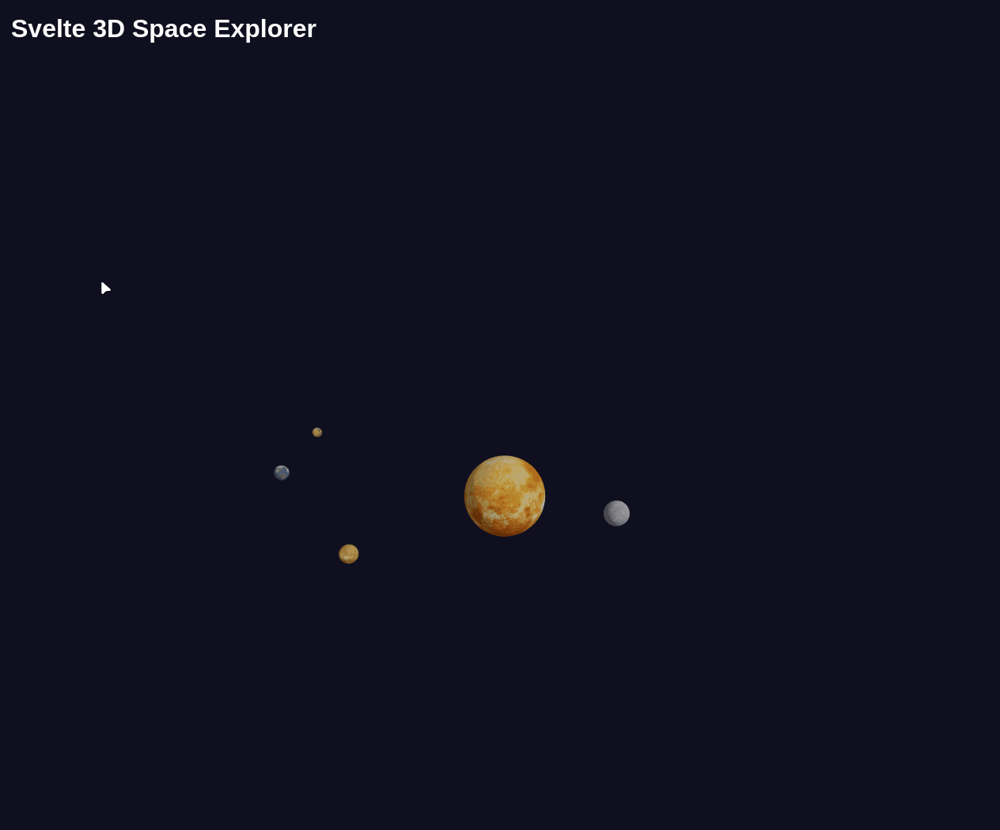

# 🚀 Svelte 3D Space Explorer 🪐



## 🛸 How to Launch This Cosmic Catastrophe

1. Clone this repository
2. Navigate to the project folder:
   ```
   cd svelte-space-explorer
   ```
3. Install dependencies (and maybe the laws of physics):
   ```
   pnpm install
   ```
4. Initiate the launch sequence:
   ```
   pnpm run dev
   ```
5. Open your browser and navigate to `http://localhost:5173`. 

## 🌌 What Even Is This?

This, dear reader, is what happens when a web developer watches too many episodes of "Cosmos" while chugging energy drinks. It's a Svelte-powered 3D solar system simulator that's about as scientifically accurate as a paper airplane in a wind tunnel.

But hey, it's got spinning planets, it's got textures, and if you squint really hard, you might just fool yourself into thinking you're NASA's newest recruit!

## 🧠 Space Trivia to Make You Sound Smart at Parties

Did you know?

- If you could drive your car straight up, you'd reach space in about an hour. Traffic on the way back is terrible though.
- Venus spins backwards compared to most planets. It's not being difficult; it's just *special*.
- Jupiter's Great Red Spot is a storm that's been raging for over 400 years. Still shorter than some meetings, am I right?
- If Saturn decided to take a bath, it would float. Unfortunately, we can't find a bathtub big enough to test this.
- Uranus is tilted on its side, so its seasons last 20 years each. That's 20 years of winter. Game of Thrones fans, eat your hearts out!

